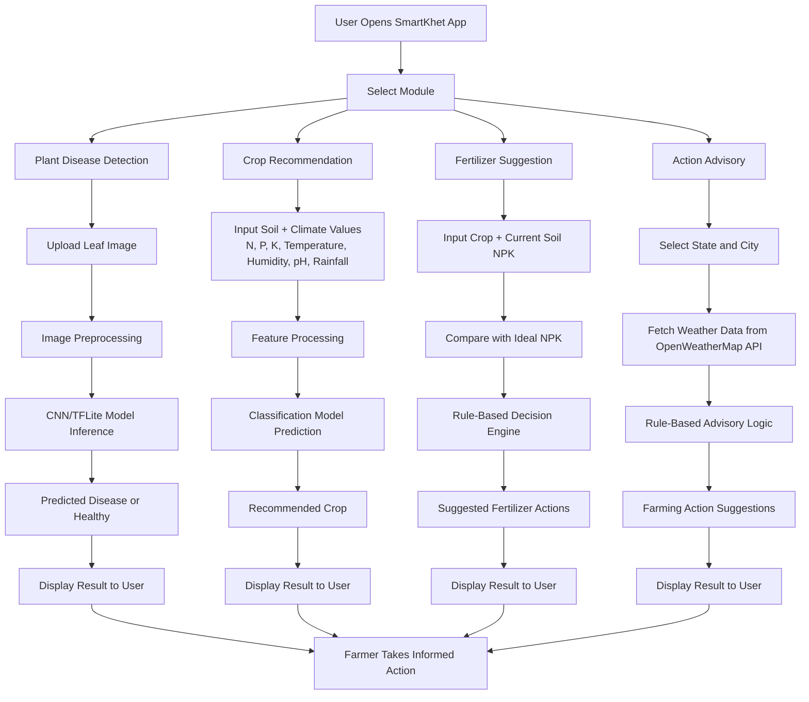

# 🌾 SmartKhet – Smart Farming Assistant

**SmartKhet** is a smart farming web application designed to assist farmers and agri-enthusiasts by integrating Deep Learning and data-driven solutions. It provides intelligent support for identifying plant diseases, choosing the right crops and fertilizers, and offering real-time action advice based on weather conditions.

---

## 🚀 Features

- **🌱 Plant Disease Detection**  
  Upload an image of a crop leaf to detect diseases using a deep learning model trained with TensorFlow and Keras.

- **🌾 Crop Recommendation**  
  Suggests the best crop to grow based on soil nutrients, temperature, humidity, pH level, and rainfall using a classification model.

- **💊 Fertilizer Suggestion**  
  Based on the nutrient requirements of crops and current soil condition, the app recommends suitable fertilizers.

- **📈 Action Advisory**  
  Provides useful farming suggestions by analyzing **real-time weather data** from OpenWeatherMap API, based on selected city and state.

---

## 🧠 Model Overview

### 🔍 1. **Plant Disease Detection**
- **Model**: Convolutional Neural Network (CNN)
- **Framework**: TensorFlow & Keras
- **Input**: Image of a leaf
- **Output**: Predicted disease (or healthy)

### 🌾 2. **Crop Recommendation**
- **Model**: Classification Model (Random Forest or similar)
- **Input Features**:
  - Nitrogen (N), Phosphorus (P), Potassium (K)
  - Temperature, Humidity
  - pH level, Rainfall
- **Output**: Recommended crop (e.g., Rice, Wheat, Cotton)

### 💊 3. **Fertilizer Suggestion**
- **Approach**: Rule-based logic
- **Logic**:
  - Compares current NPK values with ideal values for the selected crop
  - Suggests fertilizers to balance soil nutrients

### 📈 4. **Action Advisory**
- **Approach**: No ML used
- **Data Source**: Real-time weather from OpenWeatherMap API
- **Working**:
  - User selects a city and state
  - App fetches temperature, humidity, wind, rainfall, etc.
  - Based on predefined rules, it gives useful suggestions (e.g., “Apply irrigation,” “Avoid pesticide spraying,” etc.)

---

## 🧩 Process Block Diagram (End-to-End)



---

## 🛠 Tech Stack

- **Frontend**: Streamlit
- **Backend Models**: TensorFlow + Keras
- **APIs**: OpenWeatherMap
- **Languages**: Python, HTML (within markdown)

---

## 📦 Installation & Run Locally

```bash
git clone https://github.com/Aman-Kr09/smartkhet.git
cd smartkhet
pip install -r requirements.txt
streamlit run app.py

